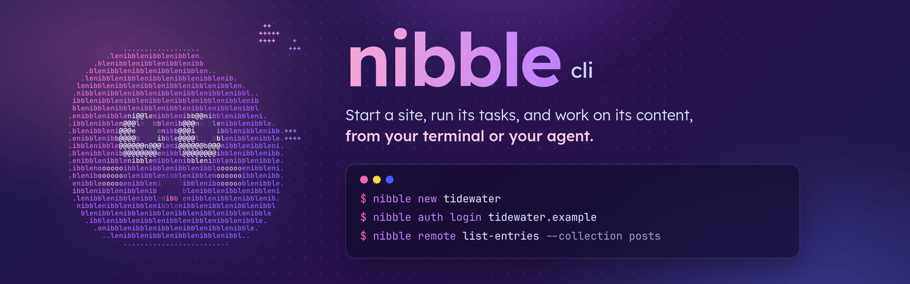

<p align="center"></p>

# nibble

The command-line tool for [Nibble](https://nibble.ink). It starts a site, runs a site's tasks, and works on the
content of any Nibble site you sign in to, as you and never as more than you.

## Install

For Linux on Intel or ARM:

```sh
curl -LsSf https://github.com/mah3uz/nibble-cli/releases/latest/download/nibble-cli-installer.sh | sh
```

For Windows, in PowerShell:

```powershell
irm https://github.com/mah3uz/nibble-cli/releases/latest/download/nibble-cli-installer.ps1 | iex
```

Either puts `nibble` in `~/.local/bin`. Each release also has a `sha256.sum` for checking a download by hand. From a
clone, `just install` builds it and does the same, and tells you if `~/.local/bin` isn't on your `PATH` yet.

## Start a site

```sh
nibble new my-site            # checks this computer, fetches the latest release, verifies it, and installs
```

## Run a site's tasks

Inside a site's folder, any word that isn't one of the tool's own runs a task: `nibble check` is
`bin/rails nibble:check`, `nibble schema show collections/posts` is `bin/rails nibble:schema:show collections/posts`.

## Work on a site's content

```sh
nibble auth login example.com          # opens the site in your browser to sign in and choose what the CLI may do
nibble remote                          # what this connection can do on the site
nibble remote list-entries --collection posts
nibble remote update-entry --id 12 --lock-version 3 --data '{"title":"Better title"}' --dry-run
```

Every operation comes from the site itself, so `nibble remote` always matches the site you're signed in to.
Changes to entries are drafts until someone who may publish does. Add `--dry-run` to see a change without saving it.

- **More than one site or account:** `nibble auth list`, `nibble auth switch example.com:you@example.com`, or
  `--site` on any command.
- **A folder that always means one site:** put `site = "example.com"` in `.nibble.toml` and run `nibble auth allow`
  there once. A `.nibble.toml` you haven't allowed is refused, so a cloned repository can't point your commands at a
  site you didn't choose.
- **Scripts and CI:** create a token under *Connected apps* in the site's Control Plane, then set `NIBBLE_SITE` and
  `NIBBLE_TOKEN`.
- **A server without a browser:** `nibble auth login example.com --device`, if the site allows signing in with a code.

Sign-ins are kept in this system's keychain. Where there is none, `--insecure-storage` keeps them in a file only you
can read, and `nibble doctor` says so.

## AI apps

```sh
nibble mcp install --client claude-code   # or codex, cursor; claude and chatgpt print where to paste the address
nibble skill install --client claude      # the site's own guide as a skill; `nibble skill sync` refreshes it
```

The site must have Agent access turned on by an administrator.

## Output

On a terminal, lists print as tables. Otherwise, or with `--json`, every command prints
`{"ok": true, "data": …, "site": …}` or `{"ok": false, "error": {"code", "message", "hint"}}`. `--pick entries.0.title`
prints one value.

## Developing

The CLI is built with Rust and [just](https://github.com/casey/just):

```sh
just test                  # formatting, clippy, unit tests, then the contract test against ../ (or: just test <path>)
just build                 # an optimised build at target/release/nibble
just install               # build it and put it in ~/.local/bin
```

The contract test starts a Nibble checkout on a test database, gives the CLI a token, and works on content through
the management API, so the CLI and Nibble can't drift apart unnoticed. Keep this repository in a Nibble checkout's
`cli/` folder: `just test` finds Nibble at `..`, and Nibble's own release script runs `script/ci` from there before it
tags a release.

`nibble remote` reads each site's operations at run time, so a new operation needs no new CLI. What the CLI relies on
is the management API's contract number, `Nibble::MANAGEMENT_API_VERSION`; `API_VERSION` in `src/api.rs` must match
it, and every answer is checked against it.

## Releasing

```sh
just release 0.2.0
```

It refuses a malformed or backwards version, a tag that exists, a dirty tree, a branch other than `main`, and an
empty `Unreleased` section in `CHANGELOG.md`. Then it sets the version in `Cargo.toml`, dates the changelog section,
runs `script/ci`, and only then commits and tags. If the checks fail, nothing is committed or tagged.

It then offers to push. The pushed tag starts [dist](https://github.com/axodotdev/cargo-dist)'s workflow in
`.github/workflows/release.yml`, which builds these and publishes them with the installers and checksums as a GitHub
release, its notes taken from the changelog:

| Target | Built on |
|---|---|
| `x86_64-unknown-linux-musl` | `ubuntu-22.04` |
| `aarch64-unknown-linux-musl` | `ubuntu-24.04-arm` |
| `x86_64-pc-windows-msvc` | `windows-2022` |

Linux builds are static, so one runs on any distribution. macOS isn't built yet. The settings are in
`dist-workspace.toml`; after changing them, run `dist generate` to rewrite the workflow, and `dist plan` to see what a
release would build.
